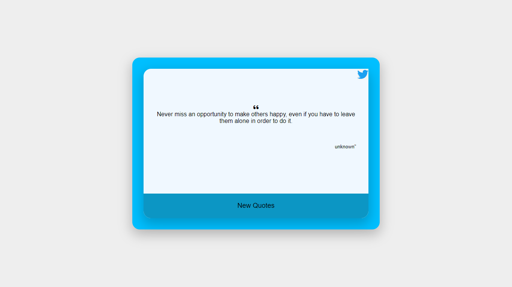

# DynamicQuotes 
Dynamic Quetes is web App where You can display a quote from a famous athlete, politician, or historical figure: and direct post on the twitter as post with help of one simple click on twitter logo.
 
 ## Landing Page

Additional description about the project and its features.
## Built With
 - HTML
 - CSS
 - JAVASCRIPT
 
 ## Live Demo
[Live Demo Link 👈](https://amulsharma64.github.io/DynamicQuotes)

## Project Requirements
### Create getQuotes Function for API call
- With the help of Fetch method get the data and save it in the objData.
- Function named getQuotes calls the getNewQuotes() function.

 ### getNewQuotes function
- Function is named getNewQuotes and prints the quote to the page using the template literals.

### tweetNow function
- Function named tweetNow create tweeter post on the click of Tweeter logo.

## Author
 ### 👤 Amul Sharma
 - Email: sharmaamul64@gmail.com
 - Twitter: [@Twitter](https://twitter.com/Amul_Sharma64)
 - Linkdin: [@Linkdin](https://www.linkedin.com/in/amul-sharma2000)
 
## Show your support
Give a ⭐️ if you like this project!
